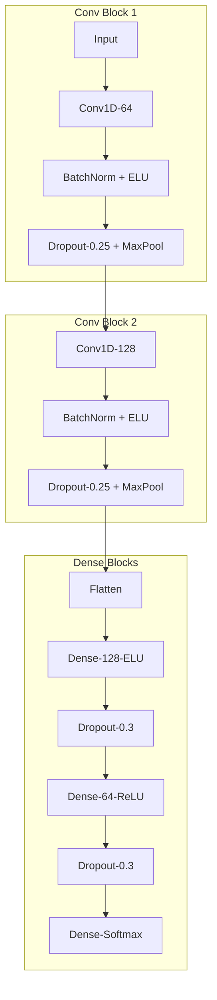

```mermaid
graph TD
    subgraph "Conv Block 1"
    A[Input] --> B[Conv1D-64]
    B --> C[BatchNorm + ELU]
    C --> D[Dropout-0.25 + MaxPool]
    end

    subgraph "Conv Block 2"
    D --> E[Conv1D-128]
    E --> F[BatchNorm + ELU]
    F --> G[Dropout-0.25 + MaxPool]
    end

    subgraph "Dense Blocks"
    G --> H[Flatten]
    H --> I[Dense-128-ELU]
    I --> J[Dropout-0.3]
    J --> K[Dense-64-ReLU]
    K --> L[Dropout-0.3]
    L --> M[Dense-Softmax]
    end
```
